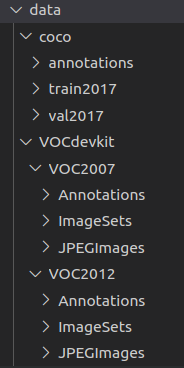

# Robust and Accurate Object Detection via Self-Knowledge Distillation
paper:https://arxiv.org/abs/2111.07239

## Environments

+ Python 3.7
+ Cuda 10.1
+ Prepare dependency

**Notes:** We revise [MMCV](https://github.com/open-mmlab/mmcv) to adapt adversarial algorithms. Therefore we suggest that you prepare environments strictly as follows:

```
conda create -n udfa python=3.7
conda activate udfa
sh prepare_env.sh
```

## Prepare datasets

+ VOC0712, download from `http://host.robots.ox.ac.uk/pascal/VOC/`, and place it under `data` directory
+ COCO2017, download from `https://cocodataset.org/#download`, and place it under `data` directory

+ The structure of datasets is shown as follows:

   

## Train

### VOC dataset
* Generate GFLV2-R34 pretrained detector (served as teacher) on PASCAL_VOC 0712:
  ```
  python -m torch.distributed.launch --nproc_per_node=4  train.py --launcher pytorch --config configs/gflv2/gflv2_r34_fpn_voc_std.py 
  cd work_dirs/gflv2_r34_fpn_voc_std
  cp epoch_12.pth ../../weights/gflv2_r34_voc_pre.pth
  ```

* Training GFLV2-R34 using udfa on PASCAL_VOC 0712:
  ```
  python -m torch.distributed.launch --nproc_per_node=4  train.py --launcher pytorch --config configs/gflv2/gflv2_r34_fpn_voc_kdss.py --load-from weights/gflv2_r34_voc_pre.pth
  ```

* Training GFLV2-R34 using udfa with advprop on PASCAL_VOC 0712:
  ```
  python -m torch.distributed.launch --nproc_per_node=4  train.py --launcher pytorch --config configs/gflv2/gflv2_r34_fpn_voc_kdss1.py --load-from weights/gflv2_r34_voc_pre.pth
  ```

* Training GFLV2-R34 using Det-AdvProp on PASCAL_VOC 0712:
  ```
  python -m torch.distributed.launch --nproc_per_node=4  train.py --launcher pytorch --config configs/gflv2/gflv2_r34_fpn_voc_mixbn.py --load-from weights/gflv2_r34_voc_pre.pth
  ```

### COCO dataset
* Generate GFLV2-R34 pretrained detector (served as teacher) on COCO:
  ```
  python -m torch.distributed.launch --nproc_per_node=4  train.py --launcher pytorch --config configs/gflv2/gflv2_r34_fpn_coco_std.py 
  cd work_dirs/gflv2_r34_fpn_coco_std
  cp epoch_12.pth ../../weights/gflv2_r34_coco_pre.pth
  ```

* Training GFLV2-R34 using udfa on COCO:
  ```
  python -m torch.distributed.launch --nproc_per_node=4  train.py --launcher pytorch --config configs/gflv2/gflv2_r34_fpn_coco_kdss.py --load-from weights/gflv2_r34_coco_pre.pth
  ```

* Training GFLV2-R34 using Det-AdvProp on COCO:
  ```
  python -m torch.distributed.launch --nproc_per_node=4  train.py --launcher pytorch --config configs/gflv2/gflv2_r34_fpn_coco_mixbn.py --load-from weights/gflv2_r34_coco_pre.pth
  ```

## Test

* Evlauate the clean AP or adversarial robustness on PASCAL_VOC 2007 test set:
  ```
  python -m torch.distributed.launch --nproc_per_node=4 test.py --launcher pytorch --configs/gflv2/gflv2_r34_fpn_voc_std.py  --checkpoint weights/gflv2_r34_voc_pre.pth --num_steps 0 --step_size 2 --eval mAP
  ```

* Evlauate the clean AP or adversarial robustness on COCO 2017val set:
  ```
  python -m torch.distributed.launch --nproc_per_node=4 test.py --launcher pytorch --configs/gflv2/gflv2_r34_fpn_coco_std.py  --checkpoint weights/gflv2_r34_coco_pre.pth --num_steps 0 --step_size 2 --eval bbox
  ```

## COCO test-dev2017 results
* gflv2_r2n101_dcn trained on 2*A6000, with single scale testing 

| model                    |  AP | AP50 | AP75 | APl | APm | APs | config |
| :-----------------: |:-----------------: |:-----------------:|:-----------------:|:-----------------:|:-----------------:|:-----------------:|:-----------------:|
| Teacher | 0.491 | 0.675 | 0.537 | 0.618 | 0.530 | 0.301 | [config](https://github.com/grispeut/udfa/blob/main/configs/gflv2/gflv2_r2n101_dcn_fpn_coco_std.py) |
| UDFA | 0.513 | 0.698 | 0.562 | 0.643 | 0.554 | 0.319 | [config](https://github.com/grispeut/udfa/blob/main/configs/gflv2/gflv2_r2n101_dcn_fpn_coco_kdss.py) |

## Acknowledgement
Our project is based on [ImageCorruptions](https://github.com/bethgelab/imagecorruptions), [MMDetection](https://github.com/open-mmlab/mmdetection) and [MMCV](https://github.com/open-mmlab/mmcv).
